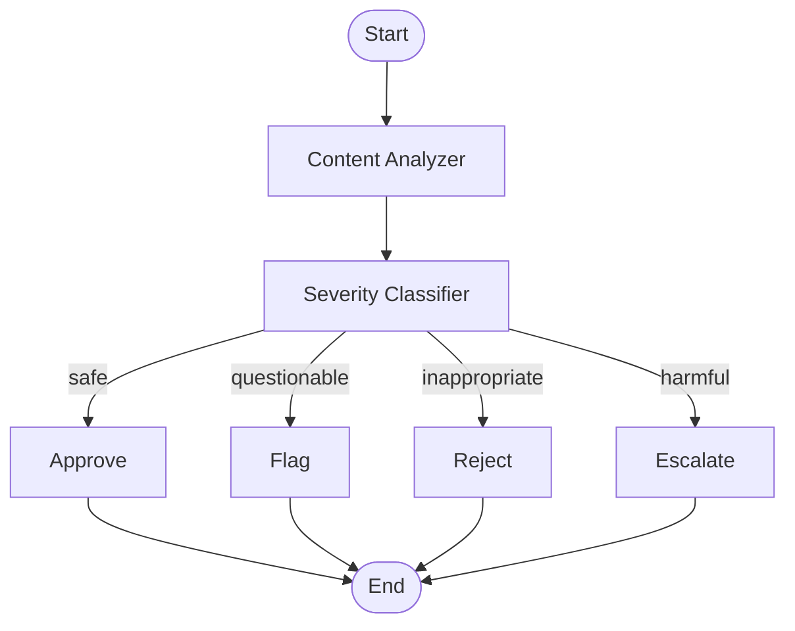

# Content Moderation System

An AI-powered content moderation system built with LangGraph that analyzes user-submitted content and routes it through appropriate moderation paths based on severity classification.

## Overview

This system provides automated content moderation using a multi-stage agentic workflow. It analyzes content, classifies severity levels, and routes content to appropriate action nodes (approve, flag, reject, or escalate) with clear explanations for moderation decisions.

## Architecture

### Workflow Graph

The system uses a LangGraph state machine with the following structure:

```
START → Content Analyzer → Severity Classifier → [Router] → {Approve/Flag/Reject/Escalate} → END
```


### Mermaid Diagram



## Workflow Stages

### 1. **Content Analyzer** (`analyse_content`)
- Pre-processes and validates raw content
- Extracts metadata (content length, word count, URL detection)
- Performs basic validation (empty content check)
- Prepares content for severity classification

### 2. **Severity Classifier** (`classify_severity`)
- Uses LLM (GPT-4o-mini) to classify content severity
- Four severity levels:
  - **Safe**: Content is appropriate, follows guidelines
  - **Questionable**: Borderline content, mild profanity, needs review
  - **Inappropriate**: Clearly violates guidelines, strong profanity, harassment
  - **Harmful**: Dangerous, illegal, or severely violates guidelines
- Returns structured output with severity and explanation

### 3. **Router** (`routing_decision`)
- Routes content to appropriate action node based on severity
- Maps severity to actions:
  - `safe` → `approve`
  - `questionable` → `flag`
  - `inappropriate` → `reject`
  - `harmful` → `escalate`

### 4. **Action Nodes**
- **Approve**: Content is safe, approved for publication
- **Flag**: Content is questionable, needs review
- **Reject**: Content is inappropriate, should be rejected
- **Escalate**: Content is harmful, needs immediate attention

## State Management

The workflow uses a custom `ModerationState` TypedDict:

```python
class ModerationState(TypedDict):
    content: str                                    # Original user content
    severity: Optional[Literal["safe", "questionable", "inappropriate", "harmful"]]
    action: Optional[Literal["approve", "flag", "reject", "escalate"]]
    explanation: Optional[str]                      # LLM-generated explanation
    metadata: Optional[dict]                       # Analysis metadata
```

## Setup & Installation

### Prerequisites

- Python 3.12 or higher
- OpenAI API key (or compatible API)

### Step 1: Clone the Repository

```bash
git clone <repository-url>
cd content-analyzer
```

### Step 2: Create Virtual Environment

```bash
python -m venv venv
source venv/bin/activate  # On Windows: venv\Scripts\activate
```

### Step 3: Install Dependencies

```bash
pip install -r requirements.txt
```

### Step 4: Configure Environment Variables

Create a `.env` file in the root directory:

```bash
OPENAI_API_KEY=your_api_key_here
```

Or set it in your environment:

```bash
export OPENAI_API_KEY=your_api_key_here
```

## Running Locally

### Option 1: Run the Streamlit UI (Recommended)

Launch the interactive chatbot interface:

```bash
streamlit run app.py
```

The UI will open in your browser at `http://localhost:8501`

**Features:**
- Interactive chat interface
- Real-time content moderation
- Conversation history
- Detailed analysis results

## Project Structure

```
content-analyzer/
├── main.py              # Core workflow definition and graph
├── app.py               # Streamlit UI application
├── requirements.txt     # Python dependencies
├── .env                 # Environment variables (not in git)
├── .gitignore          # Git ignore rules
├── graph.png           # Generated workflow visualization
└── README.md           # This file
```

## Configuration

### Model Configuration

Edit `main.py` to change the LLM model:

```python
model = ChatOpenAI(model="gpt-4o-mini", temperature=0)
```

Available models:
- Any OpenAI-compatible models

### Prompt Customization

Modify the system prompt in `classify_severity()` function to adjust classification behavior.

## UI Features

The Streamlit interface provides:

- **Chat Interface**: Submit content and receive moderation results
- **Color-Coded Feedback**: 
  - 🟢 Green for approved content
  - 🟡 Yellow for flagged content
  - 🔴 Red for rejected/escalated content
- **Analysis Details**: View severity, action, and metadata
- **Conversation History**: Track all submissions and results
- **Feedback Loop**: Revise and resubmit content until approved

## Dependencies

- **LangGraph**: Workflow orchestration
- **LangChain**: LLM integration
- **Streamlit**: Web UI
- **Pydantic**: Data validation
- **Python-dotenv**: Environment variable management


## Author
Anubhav Mandarwal ([Anubhav Mandarwal](https://github.com/VrityaCodeRishi))

